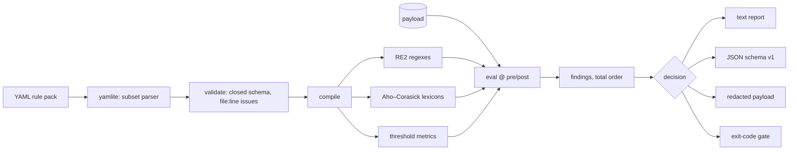

# handrail

[English](README.md) | [中文](README.zh.md) | [日本語](README.ja.md)

[](LICENSE) [](go.mod) [](CHANGELOG.md)  [](CONTRIBUTING.md)

**handrail：YAML ルールパック——正規表現・語彙リスト・しきい値——を LLM パイプライン向けの決定的な pre/post チェックへコンパイルするオープンソースのガードレールエンジン。モデルなし・通信なし、すべての判定が再現・監査可能。**


```bash
git clone https://github.com/JaydenCJ/handrail && cd handrail
go build -o handrail ./cmd/handrail    # single static binary, stdlib only
```

> プレリリース：v0.1.0 はまだどのレジストリにも公開されていません。上記のとおりソースからビルドしてください（Go ≥1.22）。

## なぜ handrail？

多くのガードレールツールは「このテキストは安全か」を別のモデルで答えます：llm-guard は transformer スキャナを走らせ、NeMo Guardrails は LLM をループに入れ、guardrails-ai はバリデータと ML チェックを混在させます。これこそ規制下のデプロイでコンプライアンスチームが受け入れられないものです——ゲートが守る対象と同じくらい不透明で、判定はモデルのバージョンで揺れ、パイプラインは数 GB をダウンロードして外部と通信します。逆の極端である手書き正規表現スクリプトは、監査はできても保守されません——スキーマもテストも一貫したレポートもない。handrail は中間の道を本気で取ります：ルールはレビュアーが行単位で読める YAML に置かれ、`lint` は不正なパックを `file:line` 付きですべて拒否し、各パックは自前のテストケース（`handrail test`）を同梱し、評価は純関数です——同じパックと同じ入力なら、どのマシンでもバイト単位で同一の検出結果を、ネットワークに一切触れない単一バイナリが返します。

| | handrail | llm-guard | guardrails-ai | NeMo Guardrails |
|---|---|---|---|---|
| 決定的な判定（ゲート内に ML なし） | ✅ | ❌ transformer スキャナ | 部分的 | ❌ LLM がループ内 |
| 完全オフライン動作・モデルDLなし | ✅ | ❌ | 部分的 | ❌ |
| 単一の静的バイナリ | ✅ | ❌ Python + torch | ❌ Python | ❌ Python |
| ルールが人間の読めるデータ（YAML） | ✅ | 設定のみ | 部分的（RAIL/コード） | Colang + プロンプト |
| file:line 付きの厳格な lint | ✅ | ❌ | ❌ | ❌ |
| ルールパックがテストを同梱 | ✅ | ❌ | ❌ | ❌ |
| スパン厳密なマスキング | ✅ | ✅ | 部分的 | ❌ |
| ランタイム依存 | 0 | 多数 | 多数 | 多数 |

<sub>依存数の確認は 2026-07-13：handrail は Go 標準ライブラリのみ。llm-guard の標準インストールは transformers と torch を取得。guardrails-ai と NeMo Guardrails は依存ツリーの大きい Python フレームワークです。</sub>

## 特長

- **3 種類のルール・1 つのスキーマ** — `regex`（RE2 なので破滅的バックトラックなし）、`lexicon`（インラインまたは別ファイルの拒否リスト）、`threshold`（長さ・エントロピー・URL 数・文字洪水など 11 の組み込みメトリクス）。
- **構造からして決定的** — 検出は文書化された全順序で返り、判定は発火したアクションの最強値、エンジン内に時計・ロケール・乱数は一切なし。監査はどの判定も再生できます。
- **本物のミスを捕まえる lint** — 閉じたキー集合がタイポを拒否し、kind 違いのキーはエラー、空文字にマッチする正規表現は拒否、パックの全問題を一度に `file:line: message` で報告。
- **パックが自分をテストする** — パック変更にはケースファイル（`input` → 期待 `decision` + 発火ルール）が付き、`handrail test` がそれをレビュー用の合否ゲートに変えます。
- **合成できるマスキング** — `redact` ルールは正確なバイトスパンをルール別の置換文字列で覆い、重なるスパンは安全に併合。`--redacted` で check がサニタイズパイプになります。
- **終了コードがポリシー** — `flag` < `redact` < `block`。`--fail-on` が 1 で終了する最弱判定を選び、shell の `if` ひとつが完全な強制ポイントになります。
- **依存ゼロ・完全オフライン** — YAML さえ内蔵の厳格なサブセットパーサで解析。バイナリにネットワークコードパスは存在せず、テレメトリもありません。

## クイックスタート

```bash
printf 'Reach me at sam@example.test or +14155550123.\nCard: 4111 1111 1111 1111\n' \
  | ./handrail check --pack examples/packs/pii-basics.yaml -
```

実際に取得した出力（block ルールが発火したため終了コード 1）：

```text
pack:   pii-basics v1.0 (6 rules)
stage:  pre
input:  72 bytes

findings (3)
  REDACT  high      email-address            12..28  "sam@example.test"
          email address in payload
  REDACT  medium    phone-e164               32..44  "+14155550123"
          international phone number in payload
  BLOCK   critical  credit-card              52..71  "4111 1111 1111 1111"
          possible payment card number

decision: block (1 block, 2 redact)
```

サニタイズパイプとして（`--redacted`、実出力）：

```text
$ echo "mail sam@example.test today" | ./handrail check --pack examples/packs/pii-basics.yaml --redacted -
mail [EMAIL] today
```

パック同梱のフィクスチャを実行（`handrail test`、実出力）：

```text
PASS  clean text passes
PASS  email is redacted
PASS  card number blocks even with spaces
PASS  cloud key blocks on the way out
PASS  pem header blocks
PASS  phone number is masked

6 passed, 0 failed
```

## ルールパック

パックは 1 つの YAML ファイルです。完全なスキーマは [docs/rule-packs.md](docs/rule-packs.md) を参照。

```yaml
pack: pii-basics
version: "1.0"
rules:
  - id: email-address
    kind: regex
    stage: both              # pre (inbound), post (outbound), or both
    action: redact           # flag | redact | block
    severity: high
    message: email address in payload
    pattern: '[A-Za-z0-9._%+-]+@[A-Za-z0-9.-]+\.[A-Za-z]{2,}'
    replacement: "[EMAIL]"
```

| 種類 | マッチ対象 | 主なオプション |
|---|---|---|
| `regex` | RE2 パターン、スパン厳密 | `pattern`/`patterns`、`case_insensitive`、`replacement` |
| `lexicon` | Aho–Corasick 語彙リスト、規模によらず一回走査 | `terms`/`terms_file`、`match: word\|substring`、`case_insensitive` |
| `threshold` | ペイロード全体のメトリクス vs `min`/`max` | `metric`（chars、urls、shannon_entropy など） |

## CLI リファレンス

`handrail check|lint|test|rules|version` — 終了コード：0 合格、1 ゲート違反 / lint 問題 / ケース失敗、2 使い方エラー、3 実行時エラー。

| フラグ（`check`） | 既定値 | 効果 |
|---|---|---|
| `--pack` | 必須 | コンパイルするルールパックファイル |
| `--stage` | `pre` | モデル境界のどちら側か：`pre` または `post` |
| `--format` | `text` | `text` または `json`（安定した `schema_version: 1`） |
| `--redacted` | off | stdout にマスク済みペイロードのみ出力（パイプモード） |
| `--fail-on` | `block` | 1 で終了する最弱判定：`flag`・`redact`・`block` |

## 検証

このリポジトリは CI を同梱しません。上記の主張はすべてローカル実行で検証します：

```bash
go test ./...            # 90 deterministic tests, offline, < 5 s
bash scripts/smoke.sh    # end-to-end CLI check, prints SMOKE OK
```

## アーキテクチャ



## ロードマップ

- [x] v0.1.0 — 3 種のルール、厳格な lint、スパンマスキング付き決定的エンジン、パック自己テスト、text/JSON レポート、90 テスト + スモークスクリプト
- [ ] `handrail serve`：loopback HTTP サイドカーで shell 以外の呼び出し側にも同じエンジンを
- [ ] パック合成（`include:`）による組織共通ベースパック
- [ ] JSON ペイロード向けフィールド限定ルール（`messages[].content` だけ検査）
- [ ] チェックサム検証（Luhn・IBAN）でカード/口座番号の誤検出を削減
- [ ] Linux/macOS/Windows 向けビルド済みリリースバイナリ

全リストは [open issues](https://github.com/JaydenCJ/handrail/issues) を参照。

## コントリビュート

issue・議論・PR を歓迎します——ローカルの手順（フォーマット、vet、テスト、`SMOKE OK`）は [CONTRIBUTING.md](CONTRIBUTING.md) へ。入門タスクは [good first issue](https://github.com/JaydenCJ/handrail/issues?q=is%3Aissue+is%3Aopen+label%3A%22good+first+issue%22)、設計の話は [Discussions](https://github.com/JaydenCJ/handrail/discussions) で。

## ライセンス

[MIT](LICENSE)
