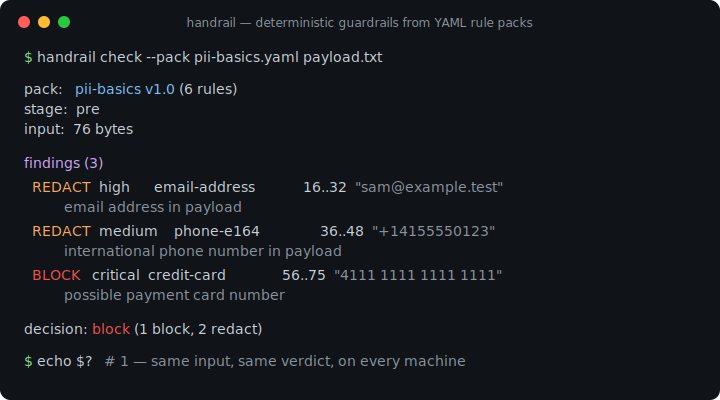
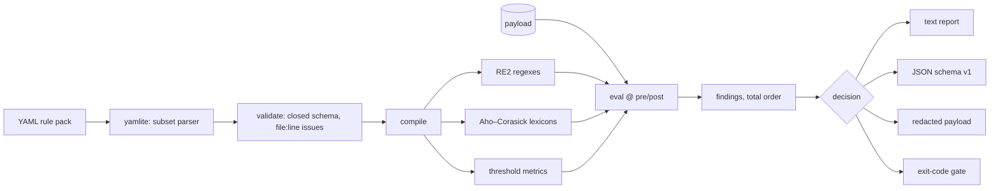

# handrail

[English](README.md) | [中文](README.zh.md) | [日本語](README.ja.md)

[](LICENSE) [](go.mod) [](CHANGELOG.md)  [](CONTRIBUTING.md)

**handrail：an open-source guardrail engine that compiles YAML rule packs — regex, lexicons, thresholds — into deterministic pre/post checks for LLM pipelines: no models, no network, every verdict reproducible and auditable.**



```bash
git clone https://github.com/JaydenCJ/handrail && cd handrail
go build -o handrail ./cmd/handrail    # single static binary, stdlib only
```

> Pre-release: v0.1.0 is not tagged on a package registry yet; build from source as above (any Go ≥1.22).

## Why handrail?

Most guardrail tooling answers "is this text safe?" with another model: llm-guard runs transformer scanners, NeMo Guardrails puts an LLM in the loop, and guardrails-ai mixes validators with ML checks. That is exactly what a compliance team in a regulated deployment cannot accept — the gate is as opaque as the thing it gates, verdicts drift with model versions, and the pipeline now downloads gigabytes and phones home. The other extreme, a hand-rolled regex script, is auditable but unmaintained: no schema, no tests, no consistent reporting. handrail takes the middle path seriously: rules live in YAML files a reviewer can read line by line, `lint` rejects every malformed pack with `file:line` positions, each pack ships its own test cases (`handrail test`), and evaluation is a pure function — same pack, same input, byte-identical findings on every machine, from a single binary that never touches the network.

| | handrail | llm-guard | guardrails-ai | NeMo Guardrails |
|---|---|---|---|---|
| Deterministic verdicts (no ML in the gate) | ✅ | ❌ transformer scanners | partial | ❌ LLM-in-the-loop |
| Works fully offline, no model downloads | ✅ | ❌ | partial | ❌ |
| Single static binary | ✅ | ❌ Python + torch | ❌ Python | ❌ Python |
| Rules are human-reviewable data (YAML) | ✅ | config only | partial (RAIL/code) | Colang + prompts |
| Strict lint with file:line errors | ✅ | ❌ | ❌ | ❌ |
| Rule packs ship their own test fixtures | ✅ | ❌ | ❌ | ❌ |
| Redaction with span-exact masking | ✅ | ✅ | partial | ❌ |
| Runtime dependencies | 0 | dozens | dozens | dozens |

<sub>Dependency counts checked 2026-07-13: handrail imports the Go standard library only; llm-guard's default install pulls transformers and torch; guardrails-ai and NeMo Guardrails are Python frameworks with large dependency trees.</sub>

## Features

- **Three rule kinds, one schema** — `regex` (RE2, so no catastrophic backtracking), `lexicon` (deny lists inline or from sidecar files), and `threshold` (11 built-in metrics: length, entropy, URL count, character floods, …).
- **Deterministic by construction** — findings come back in a documented total order, decisions are the strongest fired action, and there is no clock, locale, or randomness anywhere in the engine; audits can replay any verdict.
- **Lint that catches real mistakes** — closed key sets reject typos, cross-kind keys are errors, empty-matching regexes are refused, and every problem in a pack is reported in one pass as `file:line: message`.
- **Packs test themselves** — a pack change ships with a cases file (`input` → expected `decision` + fired rules), and `handrail test` turns it into a pass/fail gate for pack review.
- **Redaction that composes** — `redact` rules mask exact byte spans with per-rule replacement text; overlapping spans merge safely, and `--redacted` turns check into a sanitizing pipe.
- **Exit codes as policy** — `flag` < `redact` < `block`, and `--fail-on` picks the weakest decision that exits 1, so a shell `if` is a complete enforcement point.
- **Zero dependencies, fully offline** — even YAML is parsed by a built-in strict subset parser; there is no network code path in the binary at all, and no telemetry.

## Quickstart

```bash
printf 'Reach me at sam@example.test or +14155550123.\nCard: 4111 1111 1111 1111\n' \
  | ./handrail check --pack examples/packs/pii-basics.yaml -
```

Real captured output (exit code 1, because a block rule fired):

```text
pack:   pii-basics v1.0 (6 rules)
stage:  pre
input:  72 bytes

findings (3)
  REDACT  high      email-address            12..28  "sam@example.test"
          email address in payload
  REDACT  medium    phone-e164               32..44  "+14155550123"
          international phone number in payload
  BLOCK   critical  credit-card              52..71  "4111 1111 1111 1111"
          possible payment card number

decision: block (1 block, 2 redact)
```

Use it as a sanitizing pipe (`--redacted`, real output):

```text
$ echo "mail sam@example.test today" | ./handrail check --pack examples/packs/pii-basics.yaml --redacted -
mail [EMAIL] today
```

Run the pack's own fixtures (`handrail test`, real output):

```text
PASS  clean text passes
PASS  email is redacted
PASS  card number blocks even with spaces
PASS  cloud key blocks on the way out
PASS  pem header blocks
PASS  phone number is masked

6 passed, 0 failed
```

## Rule packs

A pack is one YAML file; the full schema lives in [docs/rule-packs.md](docs/rule-packs.md).

```yaml
pack: pii-basics
version: "1.0"
rules:
  - id: email-address
    kind: regex
    stage: both              # pre (inbound), post (outbound), or both
    action: redact           # flag | redact | block
    severity: high
    message: email address in payload
    pattern: '[A-Za-z0-9._%+-]+@[A-Za-z0-9.-]+\.[A-Za-z]{2,}'
    replacement: "[EMAIL]"
```

| Kind | Matches | Key options |
|---|---|---|
| `regex` | RE2 patterns, span-exact | `pattern`/`patterns`, `case_insensitive`, `replacement` |
| `lexicon` | Aho–Corasick term lists, one pass regardless of size | `terms`/`terms_file`, `match: word\|substring`, `case_insensitive` |
| `threshold` | whole-payload metrics vs `min`/`max` | `metric` (chars, urls, shannon_entropy, …) |

## CLI reference

`handrail check|lint|test|rules|version` — exit codes: 0 ok, 1 gate breach / lint issues / failed cases, 2 usage error, 3 runtime error.

| Flag (`check`) | Default | Effect |
|---|---|---|
| `--pack` | required | rule pack file to compile |
| `--stage` | `pre` | which side of the model boundary: `pre` or `post` |
| `--format` | `text` | `text` or `json` (stable `schema_version: 1`) |
| `--redacted` | off | print only the masked payload to stdout (pipe mode) |
| `--fail-on` | `block` | weakest decision that exits 1: `flag`, `redact`, or `block` |

## Verification

This repository ships no CI; every claim above is verified by local runs:

```bash
go test ./...            # 90 deterministic tests, offline, < 5 s
bash scripts/smoke.sh    # end-to-end CLI check, prints SMOKE OK
```

## Architecture



## Roadmap

- [x] v0.1.0 — three rule kinds, strict lint, deterministic engine with span redaction, pack self-tests, text/JSON reports, 90 tests + smoke script
- [ ] `handrail serve`: loopback HTTP sidecar so non-shell callers get the same engine
- [ ] Pack composition (`include:`) for org-wide base packs
- [ ] Field-scoped rules for JSON payloads (check only `messages[].content`)
- [ ] Checksum validators (Luhn, IBAN) to cut card/account false positives
- [ ] Prebuilt release binaries for Linux/macOS/Windows

See the [open issues](https://github.com/JaydenCJ/handrail/issues) for the full list.

## Contributing

Issues, discussions and pull requests are welcome — see [CONTRIBUTING.md](CONTRIBUTING.md) for the local workflow (format, vet, tests, `SMOKE OK`). Good entry points are labelled [good first issue](https://github.com/JaydenCJ/handrail/issues?q=is%3Aissue+is%3Aopen+label%3A%22good+first+issue%22), and design questions live in [Discussions](https://github.com/JaydenCJ/handrail/discussions).

## License

[MIT](LICENSE)
