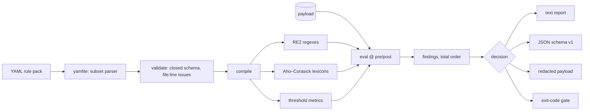

# handrail

[English](README.md) | [中文](README.zh.md) | [日本語](README.ja.md)

[](LICENSE) [](go.mod) [](CHANGELOG.md)  [](CONTRIBUTING.md)

**handrail：开源守护栏引擎，把 YAML 规则包——正则、词表、阈值——编译成 LLM 管线的确定性 pre/post 检查：不含模型、不联网，每个判定都可复现、可审计。**


```bash
git clone https://github.com/JaydenCJ/handrail && cd handrail
go build -o handrail ./cmd/handrail    # single static binary, stdlib only
```

> 预发布：v0.1.0 尚未发布到任何包注册表；请按上述方式从源码构建（任意 Go ≥1.22）。

## 为什么选 handrail？

多数守护栏工具用另一个模型来回答"这段文本安全吗"：llm-guard 跑 transformer 扫描器，NeMo Guardrails 把 LLM 放进回路，guardrails-ai 混用校验器与 ML 检查。这恰恰是受监管部署里的合规团队无法接受的——闸门和被把守的东西一样不透明，判定随模型版本漂移，管线还要下载数 GB 并向外通信。另一个极端是手写正则脚本：可审计但无人维护——没有 schema、没有测试、没有一致的报告。handrail 认真走中间路线：规则放在审阅者能逐行阅读的 YAML 文件里，`lint` 以 `file:line` 位置拒绝每个畸形规则包，每个包附带自己的测试用例（`handrail test`），求值是纯函数——同一个包、同一份输入，在任何机器上产生逐字节相同的发现，而这一切来自一个从不碰网络的单一二进制。

| | handrail | llm-guard | guardrails-ai | NeMo Guardrails |
|---|---|---|---|---|
| 判定确定（闸门里没有 ML） | ✅ | ❌ transformer 扫描器 | 部分 | ❌ LLM 在回路中 |
| 完全离线可用，无模型下载 | ✅ | ❌ | 部分 | ❌ |
| 单一静态二进制 | ✅ | ❌ Python + torch | ❌ Python | ❌ Python |
| 规则是人可审阅的数据（YAML） | ✅ | 仅配置 | 部分（RAIL/代码） | Colang + 提示词 |
| 严格 lint 且报 file:line 错误 | ✅ | ❌ | ❌ | ❌ |
| 规则包自带测试夹具 | ✅ | ❌ | ❌ | ❌ |
| 按精确跨度打码脱敏 | ✅ | ✅ | 部分 | ❌ |
| 运行时依赖 | 0 | 数十 | 数十 | 数十 |

<sub>依赖数核对于 2026-07-13：handrail 只导入 Go 标准库；llm-guard 默认安装会拉取 transformers 与 torch；guardrails-ai 与 NeMo Guardrails 是依赖树庞大的 Python 框架。</sub>

## 特性

- **三种规则、一套 schema** — `regex`（RE2，不存在灾难性回溯）、`lexicon`（内联或旁置文件的拒绝词表）、`threshold`（11 个内置指标：长度、熵、URL 数、字符洪泛……）。
- **构造即确定** — 发现按文档化的全序返回，判定取触发动作中最强者，引擎里没有时钟、locale 或任何随机性；审计可以复放任何判定。
- **能抓真错误的 lint** — 封闭键集拒绝拼写错误，跨 kind 的键是错误，匹配空串的正则被拒绝，规则包的所有问题一趟以 `file:line: message` 全部报出。
- **规则包自测** — 包的变更随附用例文件（`input` → 期望 `decision` + 触发规则），`handrail test` 把它变成包审阅的通过/失败闸门。
- **可组合的脱敏** — `redact` 规则按精确字节跨度、按规则替换文本打码；重叠跨度安全合并，`--redacted` 把 check 变成清洗管道。
- **退出码即策略** — `flag` < `redact` < `block`，`--fail-on` 选定以 1 退出的最弱判定，一个 shell `if` 就是完整的执法点。
- **零依赖、完全离线** — 连 YAML 都由内置的严格子集解析器解析；二进制里根本没有网络代码路径，也没有遥测。

## 快速上手

```bash
printf 'Reach me at sam@example.test or +14155550123.\nCard: 4111 1111 1111 1111\n' \
  | ./handrail check --pack examples/packs/pii-basics.yaml -
```

真实捕获输出（退出码 1，因为触发了 block 规则）：

```text
pack:   pii-basics v1.0 (6 rules)
stage:  pre
input:  72 bytes

findings (3)
  REDACT  high      email-address            12..28  "sam@example.test"
          email address in payload
  REDACT  medium    phone-e164               32..44  "+14155550123"
          international phone number in payload
  BLOCK   critical  credit-card              52..71  "4111 1111 1111 1111"
          possible payment card number

decision: block (1 block, 2 redact)
```

当清洗管道用（`--redacted`，真实输出）：

```text
$ echo "mail sam@example.test today" | ./handrail check --pack examples/packs/pii-basics.yaml --redacted -
mail [EMAIL] today
```

运行包自带的夹具（`handrail test`，真实输出）：

```text
PASS  clean text passes
PASS  email is redacted
PASS  card number blocks even with spaces
PASS  cloud key blocks on the way out
PASS  pem header blocks
PASS  phone number is masked

6 passed, 0 failed
```

## 规则包

一个包就是一个 YAML 文件；完整 schema 见 [docs/rule-packs.md](docs/rule-packs.md)。

```yaml
pack: pii-basics
version: "1.0"
rules:
  - id: email-address
    kind: regex
    stage: both              # pre (inbound), post (outbound), or both
    action: redact           # flag | redact | block
    severity: high
    message: email address in payload
    pattern: '[A-Za-z0-9._%+-]+@[A-Za-z0-9.-]+\.[A-Za-z]{2,}'
    replacement: "[EMAIL]"
```

| 规则种类 | 匹配对象 | 主要选项 |
|---|---|---|
| `regex` | RE2 模式，跨度精确 | `pattern`/`patterns`、`case_insensitive`、`replacement` |
| `lexicon` | Aho–Corasick 词表，规模无关的单趟扫描 | `terms`/`terms_file`、`match: word\|substring`、`case_insensitive` |
| `threshold` | 全文指标对比 `min`/`max` | `metric`（chars、urls、shannon_entropy 等） |

## CLI 参考

`handrail check|lint|test|rules|version` — 退出码：0 通过，1 闸门触发 / lint 问题 / 用例失败，2 用法错误，3 运行时错误。

| 标志（`check`） | 默认 | 作用 |
|---|---|---|
| `--pack` | 必填 | 要编译的规则包文件 |
| `--stage` | `pre` | 模型边界的哪一侧：`pre` 或 `post` |
| `--format` | `text` | `text` 或 `json`（稳定的 `schema_version: 1`） |
| `--redacted` | 关 | stdout 只输出打码后的载荷（管道模式） |
| `--fail-on` | `block` | 以 1 退出的最弱判定：`flag`、`redact` 或 `block` |

## 验证

本仓库不带 CI；以上每条断言都由本地运行验证：

```bash
go test ./...            # 90 deterministic tests, offline, < 5 s
bash scripts/smoke.sh    # end-to-end CLI check, prints SMOKE OK
```

## 架构



## 路线图

- [x] v0.1.0 — 三种规则、严格 lint、带跨度脱敏的确定性引擎、包自测、text/JSON 报告、90 个测试 + 冒烟脚本
- [ ] `handrail serve`：loopback HTTP sidecar，让非 shell 调用方用上同一引擎
- [ ] 包组合（`include:`），支持组织级基础包
- [ ] 面向 JSON 载荷的字段级规则（只检查 `messages[].content`）
- [ ] 校验和验证器（Luhn、IBAN），降低卡号/账号误报
- [ ] Linux/macOS/Windows 预编译发布二进制

完整列表见 [open issues](https://github.com/JaydenCJ/handrail/issues)。

## 参与贡献

欢迎 issue、讨论与 PR——本地工作流（格式化、vet、测试、`SMOKE OK`）见 [CONTRIBUTING.md](CONTRIBUTING.md)。入门任务标注为 [good first issue](https://github.com/JaydenCJ/handrail/issues?q=is%3Aissue+is%3Aopen+label%3A%22good+first+issue%22)，设计讨论在 [Discussions](https://github.com/JaydenCJ/handrail/discussions)。

## 许可证

[MIT](LICENSE)
